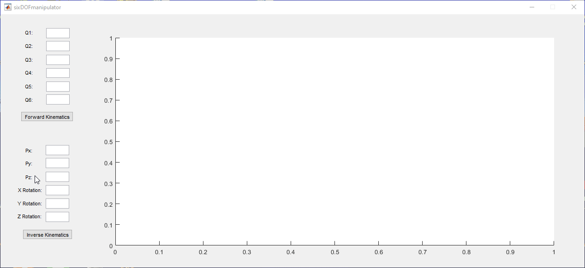

# 6DOF Robotic Manipulator Simulation

This repository contains a MATLAB simulation program for a 6DOF robotic manipulator using the Peter Corke Robotics Toolbox. The project provides a GUI for controlling the manipulator and simulating its movements based on given joint angles or end-effector positions. The calculations for the kinematics are provided in the accompanying PDF file.

## Table of Contents

-   [Installation](#installation)
-   [Using the 6DOF Manipulator GUI](#using-the-6dof-manipulator-gui)
-   [Features](#features)
-   [References and Documentation](#references-and-documentation)

## Installation

1.  **Clone the repository**:
```
    git clone https://github.com/eminemirhansener/6DOF-Robotic-Manipulator-in-MATLAB-Using-Peter-Corke-Robotics-Toolbox.git
```
2.  **Install MATLAB**: Ensure you have MATLAB installed on your machine. The GUI and simulation scripts are compatible with MATLAB R2023b. No other versions were controlled.
3.  **Install the Robotics Toolbox**: Download and install the Peter Corke Robotics Toolbox for MATLAB from [here](https://petercorke.com/toolboxes/robotics-toolbox/).

### Using the 6DOF Manipulator GUI

#### Ensure all Denavit-Hartenberg (DH) parameters are adjusted to match the specific dimensions of your robotic manipulator in the sixDOFmanipulator.m code file.

#### Forward Kinematics

1.  **Input Joint Angles:**
    -   Enter the joint angles for each of the six joints (Q1 to Q6) in the corresponding text boxes on the left side of the GUI.
    -   Ensure the angles are within the valid range for your specific manipulator.
2.  **Compute Forward Kinematics:**
    -   Click the "Forward Kinematics" button.
    -   The GUI will compute the position and orientation of the end-effector based on the provided joint angles.
    -   The resulting position and orientation will be visualized in the 3D plot on the right.


#### Inverse Kinematics

1.  **Input End-Effector Position and Orientation:**
    -   Enter the desired position (Px, Py, Pz) and orientation (X Rotation, Y Rotation, Z Rotation) of the end-effector in the corresponding text boxes on the left side of the GUI.
    -   Ensure the position and orientation are within the reachable workspace of the manipulator.
2.  **Compute Inverse Kinematics:**
    -   Click the "Inverse Kinematics" button.
    -   The GUI will compute the required joint angles to achieve the specified end-effector position and orientation.
    -   The resulting joint angles will be used to visualize the manipulator's configuration in the 3D plot on the right.



## Features

-   **Forward Kinematics**: Calculates and visualizes the manipulator's pose based on given joint angles.
-   **Inverse Kinematics**: Calculates and visualizes the required joint angles to reach a specified end-effector position and orientation.
-   **Real-time Visualization**: The GUI provides real-time updates of the manipulator's position and trajectory in a 3D plot.
-   **Path Plotting:** Visualizes the trajectory of the robot when all joints move at the same rotational speed, allowing users to observe the path followed by the end-effector.

## References and Documentation

For detailed calculations and theoretical background, refer to the 6DOF_Robotic_Manipulator_Calculations.pdf included in the repository.
